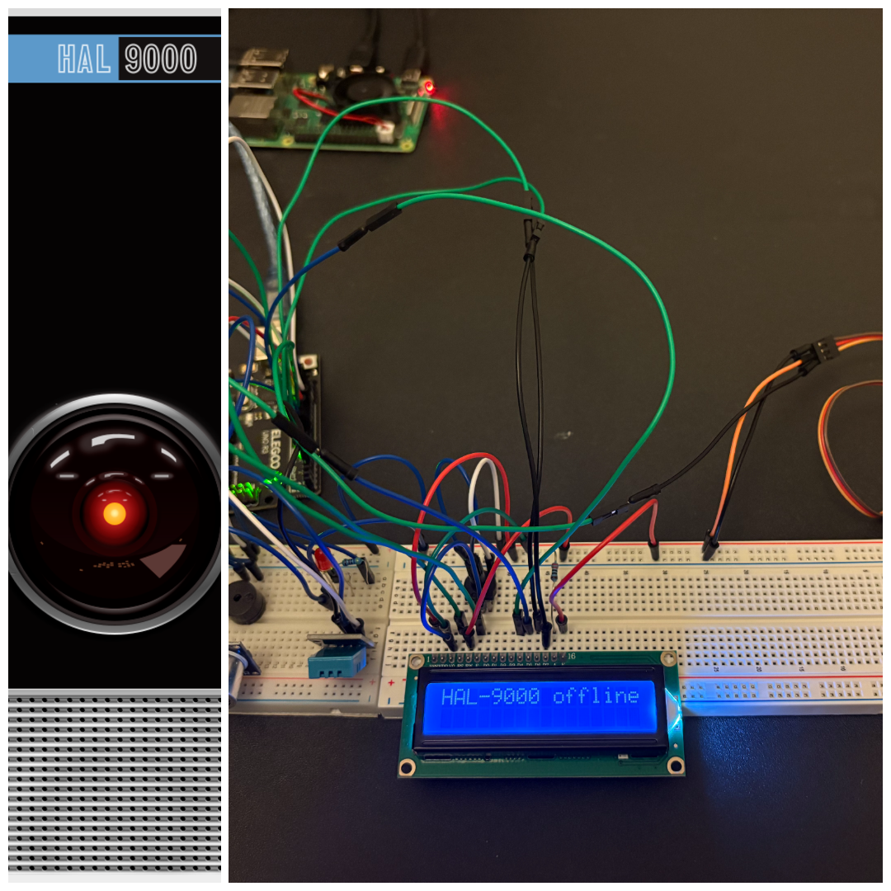
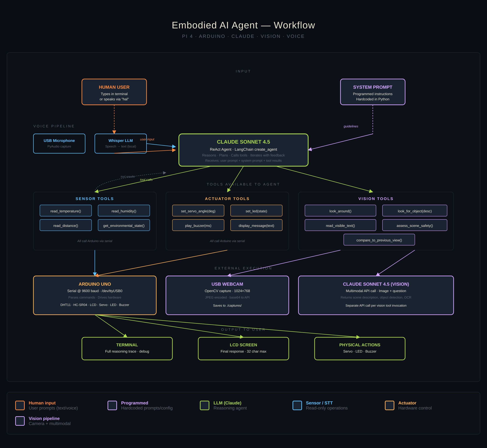

# AGENTIC HAL_9000

Hal_9000 from 2001: A space odyssey. 

The agentic AI is anthropic claude model with langchain framework.

The workflow is as follows. 

raspberry pi takes input from user, forwards that to the LLM on cloud.

Depending on the LLM's output the agent uses tools and executes actions after thinking. 

The setup contains:
* Arduino Uno 
* Raspberry PI model 4
* Ultrasonic sensor
* Temperature and Humidity sensor
* Servo motor
* LED bulbs
* LCD display
* Passive Buzzer